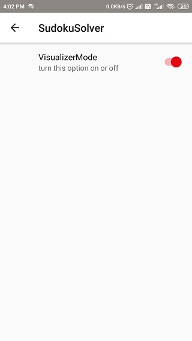

# SudokuSolver

Sudoku solver uses backtracking algorithm to solve the puzzles. it allows the user to either solve an existing 
puzzle from the app by themselves, use the solver to solve or to insert a new puzzle in to the app. [Click here](https://github.com/MansoorCM/SudokuSolver/blob/master/sudokuSolver.apk) to download the apk file.

## Main screen

The main screen allows the user to decide if he wants to solve a puzzle from the app or to insert his own puzzle.

## Puzzle from App

Either solve by using the custom view on the bottom to input numbers(click on a square on the sudoku board to highlight it.then click on a 
number to insert it to the square) or click 'use solver' to use the solver.

## Using the Solver

The app uses a delay to show the solving process and the user can avoid the delay by pressing the 'Skip to the solution'
button.

## Puzzle Solved

After solving the user is presented the choice for a new puzzle from app or to insert a new puzzle.

## Insert puzzle

Use the custom view on the bottom to input the puzzle(click on a square on the sudoku board to highlight it.then click on a 
number to insert it to the square)
using a wrong puzzle will be detected by the algorithm while using the solver

## Settings

the user can also avoid the delay used to show the animation by unchecking the 'visualizer mode' setting.
